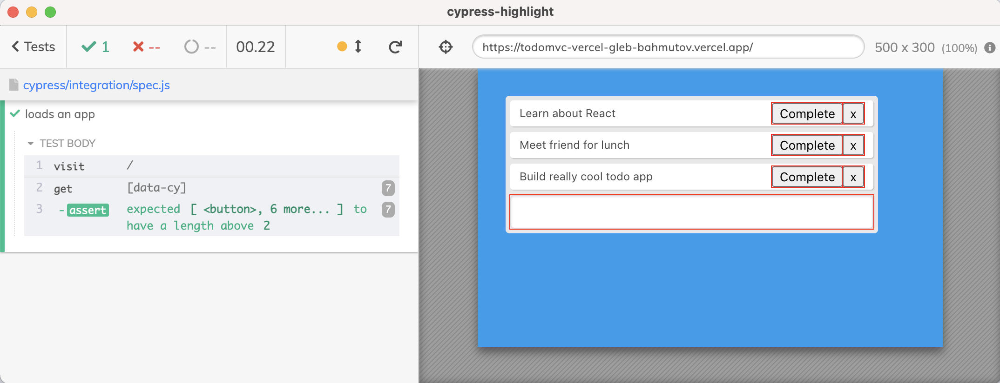

# cypress-highlight
[![ci status][ci image]][ci url] [![renovate-app badge][renovate-badge]][renovate-app] 
> Highlights all elements on the page with good test selectors by injecting a CSS rule



## Videos

- [Add A Red Border Around Elements That Have data-cy Attribute](https://youtu.be/pHzroBFY5V0)

## Install

```shell
$ npm install -D cypress-highlight
# or using Yarn
$ yarn add -D cypress-highlight
```

## Use

```js
import { highlight } from 'cypress-highlight'

it('loads an app', () => {
  cy.visit('/')
  highlight()
  // you can capture a screenshot to see the elements
  // with good test selectors
  cy.screenshot('highlights', { capture: 'runner' })
})
```

See [spec.js](./cypress/integration/spec.js)

### Multiple selectors

By default, this module highlight all elements with `data-cy` attribute. You can pass your own list of selectors to highlight. For example, to highlight all elements with data attribute `test-id` and all elements with class name `testable`, use

```js
highlight('[data-test-id]', '.testable')
```

## Read

[Cypress best practices for selecting elements](https://on.cypress.io/best-practices#Selecting-Elements)

## Small print

Author: Gleb Bahmutov &lt;gleb.bahmutov@gmail.com&gt; &copy; 2021

- [@bahmutov](https://twitter.com/bahmutov)
- [glebbahmutov.com](https://glebbahmutov.com)
- [blog](https://glebbahmutov.com/blog)
- [videos](https://www.youtube.com/glebbahmutov)
- [presentations](https://slides.com/bahmutov)
- [cypress.tips](https://cypress.tips)

License: MIT - do anything with the code, but don't blame me if it does not work.

Support: if you find any problems with this module, email / tweet /
[open issue](https://github.com/bahmutov/cypress-highlight/issues) on Github

## MIT License

Copyright (c) 2021 Gleb Bahmutov &lt;gleb.bahmutov@gmail.com&gt;

Permission is hereby granted, free of charge, to any person
obtaining a copy of this software and associated documentation
files (the "Software"), to deal in the Software without
restriction, including without limitation the rights to use,
copy, modify, merge, publish, distribute, sublicense, and/or sell
copies of the Software, and to permit persons to whom the
Software is furnished to do so, subject to the following
conditions:

The above copyright notice and this permission notice shall be
included in all copies or substantial portions of the Software.

THE SOFTWARE IS PROVIDED "AS IS", WITHOUT WARRANTY OF ANY KIND,
EXPRESS OR IMPLIED, INCLUDING BUT NOT LIMITED TO THE WARRANTIES
OF MERCHANTABILITY, FITNESS FOR A PARTICULAR PURPOSE AND
NONINFRINGEMENT. IN NO EVENT SHALL THE AUTHORS OR COPYRIGHT
HOLDERS BE LIABLE FOR ANY CLAIM, DAMAGES OR OTHER LIABILITY,
WHETHER IN AN ACTION OF CONTRACT, TORT OR OTHERWISE, ARISING
FROM, OUT OF OR IN CONNECTION WITH THE SOFTWARE OR THE USE OR
OTHER DEALINGS IN THE SOFTWARE.

[ci image]: https://github.com/bahmutov/cypress-highlight/workflows/ci/badge.svg?branch=main
[ci url]: https://github.com/bahmutov/cypress-highlight/actions
[renovate-badge]: https://img.shields.io/badge/renovate-app-blue.svg
[renovate-app]: https://renovateapp.com/
